# Messager app - A flutter messaging app

Messager is an app made with **Flutter** framework to provide messaging functionality. **The release apk is available under the release tags. It's also available on this drive link - [Messager APK](https://drive.google.com/drive/folders/1MfHkegrGcXWkxJ_-XtXV8pOej1_W_ARP?usp=sharing)**

:art: The UI is inspired by native android messaging app.

## :iphone: App Features

  - Real time messaging with users.
  - Groups with multiple users.
  - URL sharing and preview.
  - Searching messages.
  - Adding and viewing contacts.
  - Spamming and archiving messages.

## :wrench: Technical Features

  - Firebase Phone Authentication.
  - Provider State Management.
  - MVVM Architecture.
  - Firestore Database Storage.
  - Session persistence using Shared Preferences.
  - Reusable services architecture and code.
  - Streams for real time.
  - Full documentation.

<brs>

<kbd>

</kbd>

  

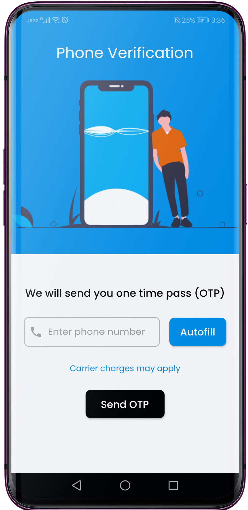&nbsp;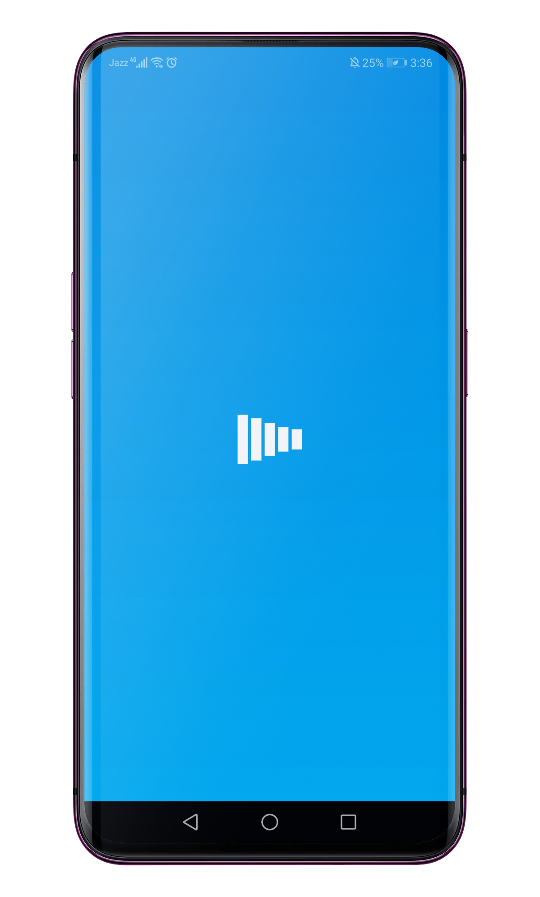&nbsp;&nbsp;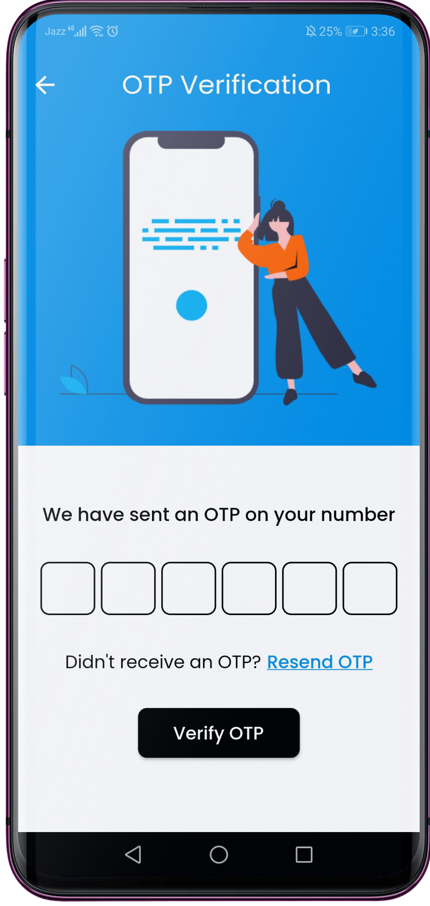  
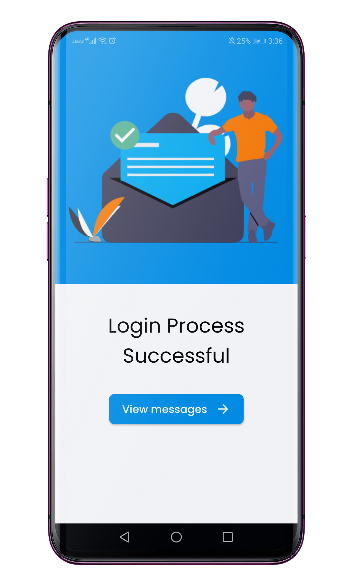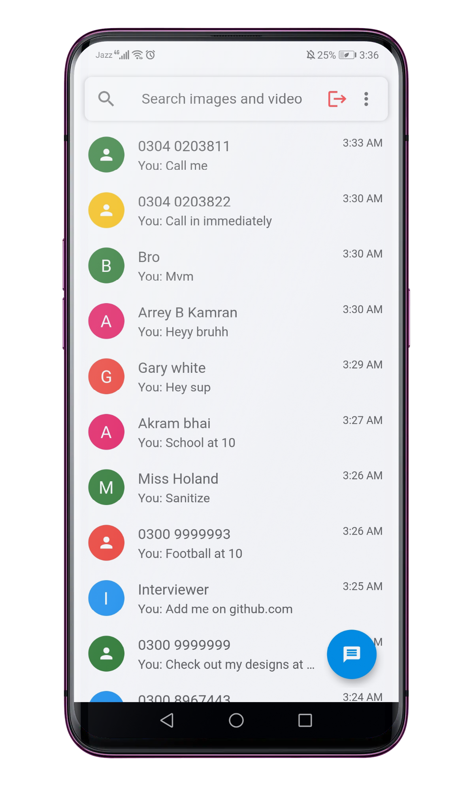&nbsp;&nbsp;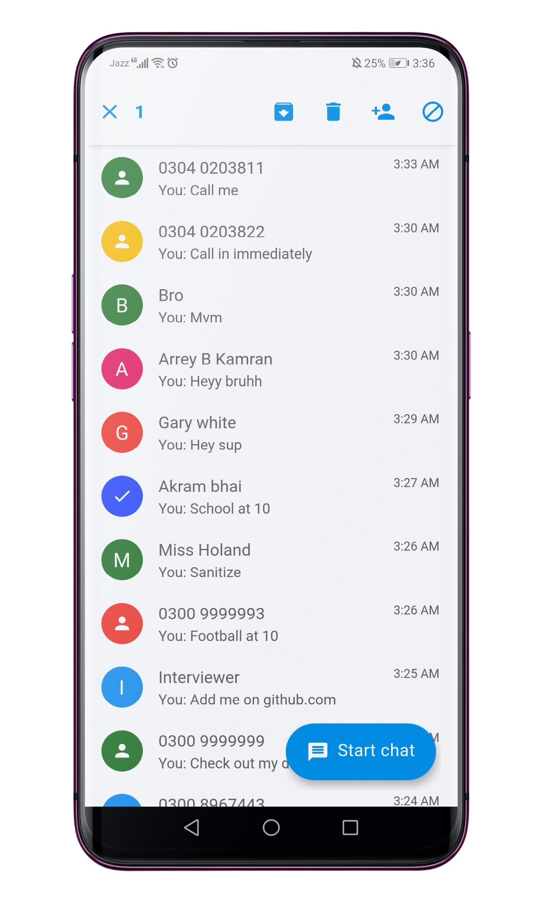  
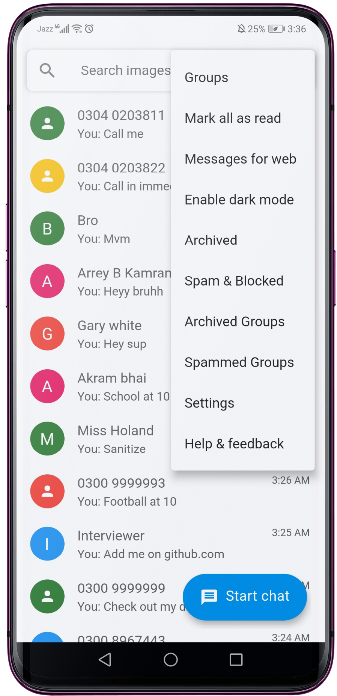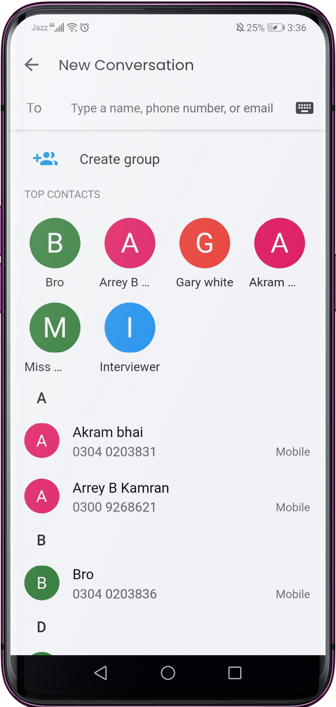&nbsp;&nbsp;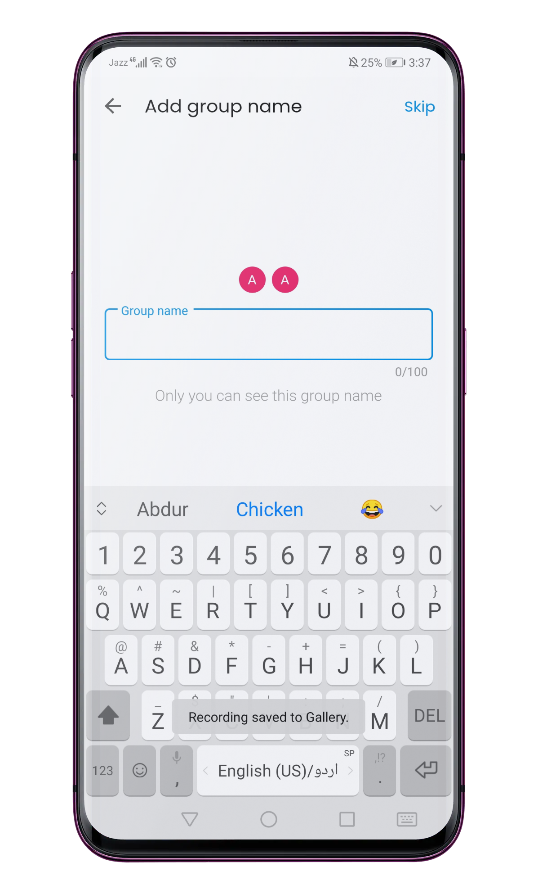  
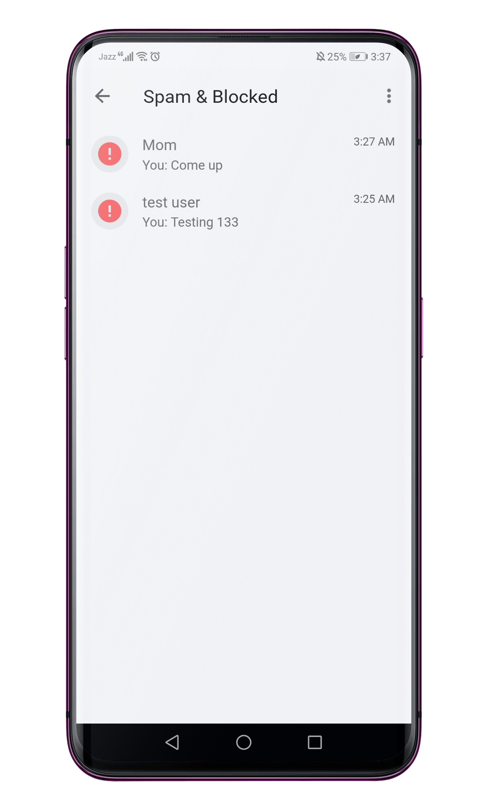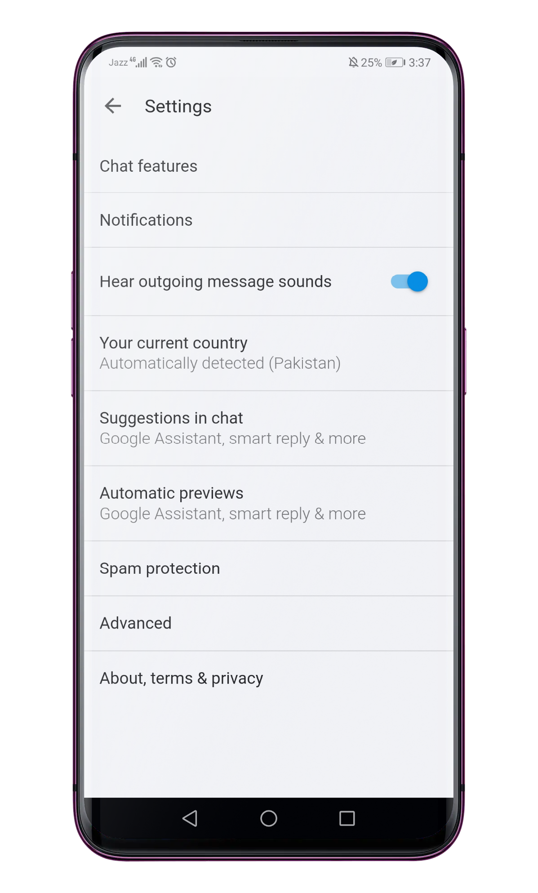  
&nbsp;&nbsp;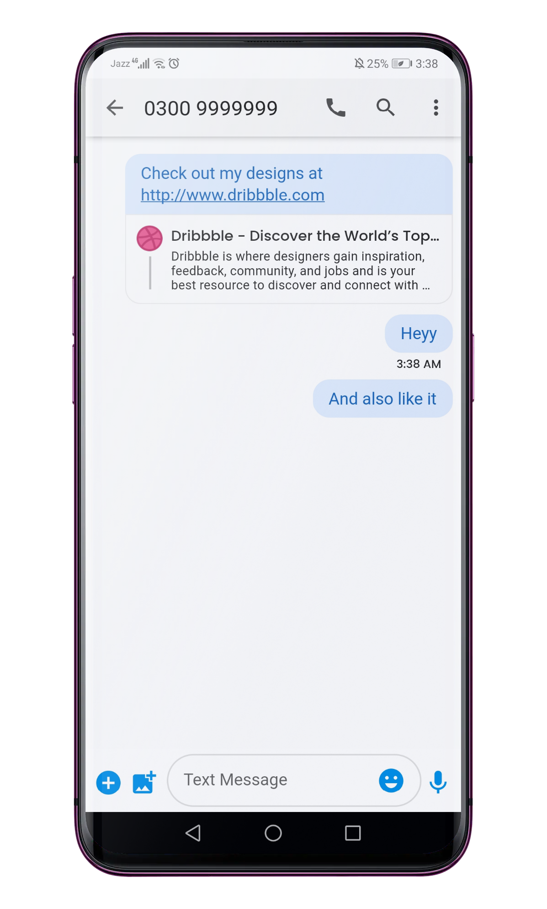  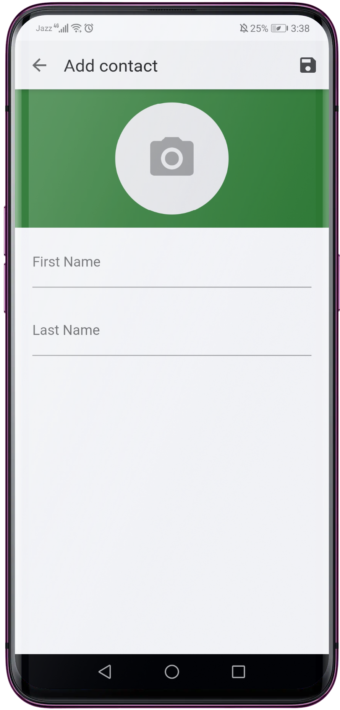  

## ⭐ Future Features

  - Favouriting messages.
  - Deleting messages.
  - Multimedia messages.
  - Maps API for location sharing.
  - Dark mode.
  - Messages for Web support.
  - FAQ page.

*Feel free to fork and contribute to include these features.* ❤︎

## 🚀 Technologies

  - [Flutter v1.22.6](https://storage.googleapis.com/flutter_infra/releases/stable/windows/flutter_windows_1.22.6-stable.zip)
  - Dart v2.10.4

## 🤝 Contribute

To contribute, fork the repository and push the changes to the **master** branch. Then submit a pull request for merging with the source. If your code passes the review and checks it will be merged into the master branch.

## 💬 Feedback

Feel free to send us feedback on [Twitter](https://twitter.com/gitpointapp) or [file an issue](https://github.com/arafaysaleem/message_app/issues/new). Feature requests are always welcome.

## 📝 License

Licensed under the [MIT License](./LICENSE).
